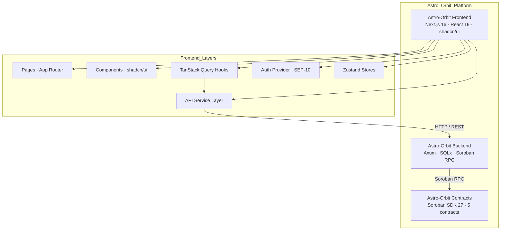

# Astro Orbit

[](https://github.com/Astro-Orbit/Astro-Orbit-frontend/actions/workflows/ci.yml)
[](LICENSE)

**Frontend — Web dashboard and developer portal for the Astro Orbit platform.**

A Stellar-native developer platform for building, securing, deploying, and managing Soroban smart contracts.

## Overview

Astro Orbit Frontend is the web dashboard where developers manage their entire Soroban workflow. It provides a visual interface for creating organizations, registering projects, deploying contracts, monitoring activity, and managing team access — all backed by the Astro Orbit REST API and Soroban smart contracts on Stellar.

## Features

- **Dashboard**: Real-time stats (projects, contracts, deployments), activity feed, and quick actions
- **Organizations**: Create and manage teams with role-based access (owner, admin, developer, viewer)
- **Project Management**: Group contracts under projects scoped to an organization
- **Contract Management**: Register, view, and version Soroban contracts
- **Deployment Tracking**: Monitor deployment pipeline — status badges, logs viewer, full history
- **Analytics**: Aggregate stats across your entire ecosystem
- **Repository Management**: Link and sync git repositories to projects
- **Stellar Wallet Auth**: SEP-10 challenge flow with JWT session management
- **Settings**: Profile, appearance (light/dark), API keys

## Architecture



### Page Structure

| Route                  | Page              | Description                                  |
| ---------------------- | ----------------- | -------------------------------------------- |
| `/`                    | Landing           | Public landing page                          |
| `/login`               | Login             | SEP-10 wallet authentication                 |
| `/dashboard`           | Dashboard         | Stats cards, activity feed, quick actions    |
| `/organizations`       | Org List          | Browse and create organizations              |
| `/organizations/new`   | Create Org        | New organization form                        |
| `/organizations/[id]`  | Org Detail        | Org overview, member count, linked projects  |
| `/projects`            | Projects          | Project list across all orgs                 |
| `/projects/[id]`       | Project Detail    | Project info, contracts tab, deployments tab |
| `/contracts`           | Contracts         | Contract list with status and version badges |
| `/contracts/[id]`      | Contract Detail   | Metadata, contract ID, source hash, network  |
| `/deployments`         | Deployments       | Deployment list with status colors           |
| `/deployments/[id]`    | Deployment Detail | Logs viewer, contract ID, environment        |
| `/analytics`           | Analytics         | Stats cards and full activity feed           |
| `/repositories`        | Repositories      | Linked git repos with provider badges        |
| `/settings/profile`    | Profile           | User profile settings                        |
| `/settings/appearance` | Appearance        | Theme toggle (light/dark)                    |
| `/settings/api-keys`   | API Keys          | Manage API keys                              |

## Tech Stack

| Layer          | Technology                  | Purpose                                     |
| -------------- | --------------------------- | ------------------------------------------- |
| Framework      | Next.js 16 (App Router)     | React meta-framework with SSR and RSC       |
| UI Library     | React 19                    | Component model                             |
| Styling        | Tailwind CSS v4 + shadcn/ui | Utility-first CSS + prebuilt components     |
| State (Server) | TanStack Query v5           | Server state caching, mutations, refetching |
| State (Client) | Zustand v5                  | Client-side state management                |
| Forms          | React Hook Form + Zod       | Form validation and submission              |
| HTTP           | Axios                       | API client with interceptors and retry      |
| Auth           | SEP-10 (Stellar) + JWT      | Wallet-based authentication                 |
| Icons          | Lucide React                | Icon component library                      |
| Date           | date-fns v4                 | Date formatting and manipulation            |
| Testing        | Vitest + Testing Library    | Unit and integration tests                  |
| E2E            | Playwright                  | End-to-end browser tests                    |
| Storybook      | Storybook v10               | UI component development and documentation  |

## Service Layer

All API communication is handled through service classes that extend `BaseService`:

| Service               | Base Path                           | Key Methods                                                |
| --------------------- | ----------------------------------- | ---------------------------------------------------------- |
| `AuthService`         | `/auth/*`                           | `challenge`, `login`, `refresh`, `logout`                  |
| `UserService`         | `/users/*`                          | `getMe`, `updateMe`                                        |
| `OrganizationService` | `/organizations/*`                  | `create`, `list`, `getById`, `update`, `invite`, `members` |
| `ProjectService`      | `/orgs/:orgId/projects`             | `create`, `list`, `getById`, `update`, `remove`            |
| `ContractService`     | `/projects/:projectId/contracts`    | `create`, `list`, `getById`, `versions`                    |
| `DeploymentService`   | `/projects/:projectId/deployments`  | `create`, `list`, `getById`, `rollback`, `cancel`, `logs`  |
| `RepoService`         | `/projects/:projectId/repositories` | `create`, `list`, `getById`, `remove`, `sync`              |
| `AnalyticsService`    | `/orgs/:orgId/analytics`            | `overview`, `dashboardStats`, `activityFeed`               |

### BaseService Pattern

```typescript
abstract class BaseService {
  protected static async get<T>(path: string, params?: Record<string, string>): Promise<T>;
  protected static async post<T>(path: string, body?: unknown): Promise<T>;
  protected static async put<T>(path: string, body?: unknown): Promise<T>;
  protected static async patch<T>(path: string, body?: unknown): Promise<T>;
  protected static async delete<T>(path: string): Promise<T>;
}
```

Each service provides typed methods that call these base methods with the correct API endpoints and TypeScript generics.

## TanStack Query Hooks

Server state is managed through custom hooks. Each hook handles loading, error, and caching states:

| Hook                         | Query Key                     | Returns          | Auto-Refresh     |
| ---------------------------- | ----------------------------- | ---------------- | ---------------- |
| `useOrganizations`           | `['organizations']`           | `Organization[]` | —                |
| `useOrganization(id)`        | `['organization', id]`        | `Organization`   | —                |
| `useCreateOrganization`      | mutation                      | —                | Invalidates orgs |
| `useProjects(orgId)`         | `['projects', orgId]`         | `Project[]`      | —                |
| `useProject(id)`             | `['project', id]`             | `Project`        | —                |
| `useContracts(projectId)`    | `['contracts', projectId]`    | `Contract[]`     | —                |
| `useContract(id)`            | `['contract', id]`            | `Contract`       | —                |
| `useDeployments(projectId)`  | `['deployments', projectId]`  | `Deployment[]`   | —                |
| `useDeployment(id)`          | `['deployment', id]`          | `Deployment`     | —                |
| `useRepositories(projectId)` | `['repositories', projectId]` | `Repository[]`   | —                |
| `useDashboardStats(orgId)`   | `['dashboard-stats', orgId]`  | `DashboardStats` | 60s              |
| `useActivityFeed(limit)`     | `['activity-feed', limit]`    | `ActivityItem[]` | 30s              |

## Project Structure

```
src/
├── app/                       # Next.js App Router pages
│   ├── (auth)/               # Auth route group
│   │   └── login/            # Login page
│   ├── (dashboard)/          # Dashboard route group (authenticated)
│   │   ├── dashboard/        # Main dashboard
│   │   ├── organizations/    # Organization CRUD
│   │   ├── projects/         # Project listing and detail
│   │   ├── contracts/        # Contract listing and detail
│   │   ├── deployments/      # Deployment listing and detail
│   │   ├── analytics/        # Analytics dashboard
│   │   └── repositories/     # Repository listing
│   ├── (settings)/           # Settings route group
│   │   └── settings/         # Profile, appearance, API keys
│   ├── layout.tsx            # Root layout
│   └── page.tsx              # Landing page
├── components/               # UI components
│   ├── ui/                  # shadcn/ui primitives
│   ├── layouts/             # Sidebar, top nav, mobile nav
│   └── auth/                # Auth-related components
├── providers/                # React context providers
│   ├── auth-provider.tsx    # Auth state management
│   └── query-provider.tsx   # TanStack Query provider
├── services/                 # API service layer
│   ├── base.ts              # BaseService with CRUD methods
│   ├── auth.ts              # Auth service
│   ├── analytics.ts         # Analytics service
│   ├── contracts.ts         # Contract service
│   ├── deployments.ts       # Deployment service
│   ├── orgs.ts              # Organization service
│   ├── projects.ts          # Project service
│   └── repos.ts             # Repository service
├── stores/                   # Zustand stores
│   └── auth-store.ts        # Auth persistence
├── hooks/                    # Custom TanStack Query hooks
│   ├── use-analytics.ts     # Dashboard stats + activity
│   ├── use-contracts.ts     # Contract queries
│   ├── use-deployments.ts   # Deployment queries
│   ├── use-orgs.ts          # Organization queries
│   ├── use-projects.ts      # Project queries
│   └── use-repos.ts         # Repository queries
├── lib/                      # Utilities
│   ├── api-client.ts        # Axios instance with interceptors
│   └── utils.ts             # cn() helper
├── tokens/                   # Design tokens
├── types/                    # TypeScript type definitions
│   └── index.ts             # All domain types
└── constants/               # App constants
    └── index.ts             # ROUTES, API_ENDPOINTS, STORAGE_KEYS
```

## TypeScript Types

All domain models are defined in `src/types/index.ts`:

```typescript
interface User { id, displayName, walletAddress, email, avatarUrl, createdAt }
interface Organization { id, name, slug, description, role, memberCount, createdAt }
interface Project { id, organizationId, name, slug, description, network, createdAt }
interface Contract { id, projectId, name, contractType, contractId, version, status, network, createdAt }
interface Deployment { id, projectId, contractName, environment, status, version, network, contractId, logs, createdAt }
interface Repository { id, projectId, name, url, provider, defaultBranch, isPrivate, createdAt }
interface DashboardStats { totalProjects, totalContracts, totalDeployments, successfulDeployments, ... }
interface ActivityItem { id, type, message, action, resourceType, timestamp, createdAt }
interface ApiError { code, message, status, details? }
interface PaginatedResponse<T> { success, data[], pagination: { page, limit, total, totalPages } }
```

## Environment Variables

| Variable                      | Default                    | Description                       |
| ----------------------------- | -------------------------- | --------------------------------- |
| `NEXT_PUBLIC_API_URL`         | `http://localhost:8080/v1` | Backend API base URL              |
| `NEXT_PUBLIC_APP_NAME`        | `Astro Orbit`              | Application display name          |
| `NEXT_PUBLIC_STELLAR_NETWORK` | `testnet`                  | Stellar network (testnet/mainnet) |

## Getting Started

### Prerequisites

- Node.js 18+
- npm 9+
- Backend server running (see [Astro-Orbit Backend](../Astro-Orbit-backend))

### Setup

```bash
cp .env.example .env.local
npm install
npm run dev
```

Open [http://localhost:3000](http://localhost:3000).

### Available Scripts

| Script                  | Command                                       | Description                             |
| ----------------------- | --------------------------------------------- | --------------------------------------- |
| `npm run dev`           | `next dev`                                    | Start development server with Turbopack |
| `npm run build`         | `next build`                                  | Production build                        |
| `npm start`             | `next start`                                  | Start production server                 |
| `npm run lint`          | `eslint src/ --ext .ts,.tsx --max-warnings 0` | ESLint check                            |
| `npm run typecheck`     | `tsc --noEmit`                                | TypeScript check                        |
| `npm run test`          | `vitest run`                                  | Run unit/integration tests              |
| `npm run test:watch`    | `vitest`                                      | Watch mode tests                        |
| `npm run test:coverage` | `vitest run --coverage`                       | Tests with coverage report              |
| `npm run test:e2e`      | `playwright test`                             | End-to-end Playwright tests             |
| `npm run storybook`     | `storybook dev -p 6006`                       | Storybook component library             |
| `npm run check`         | `typecheck && lint && test && build`          | All quality gates                       |
| `npm run format`        | `prettier --write`                            | Format all files                        |
| `npm run format:check`  | `prettier --check`                            | Check formatting                        |

## Docker

```bash
docker build -t astro-orbit-frontend .
docker run -p 3000:3000 astro-orbit-frontend
```

## Cross-Repository Links

| Repository                                                                    | Description                                     |
| ----------------------------------------------------------------------------- | ----------------------------------------------- |
| [Astro-Orbit Backend](https://github.com/Astro-Orbit/Astro-Orbit-backend)     | Rust REST API & Soroban RPC integration layer   |
| [Astro-Orbit Contracts](https://github.com/Astro-Orbit/Astro-Orbit-contracts) | Soroban smart contracts (5 contracts, 30 tests) |

## Error Handling

The frontend handles errors at multiple layers:

- **API Client**: Axios interceptors catch 401 (auto-refresh token), 403 (redirect), 429 (retry with backoff)
- **TanStack Query**: Each hook exposes `error` state; retry logic configured globally
- **UI**: Toast notifications via `sonner` for mutations, inline error states for queries
- **Auth Provider**: Token expiry handling, redirect to login on session loss

## State Machine (Auth Flow)

```
┌──────────┐    ┌───────────────┐    ┌──────────┐
│  Login    │───▶│  Authenticated │───▶│  Expired  │
│  Page     │    │  (JWT stored)  │    │  (401)   │
└──────────┘    └───────┬───────┘    └──────────┘
                        │                   │
                        │ refresh            │ redirect
                        ▼                   ▼
                  ┌──────────────┐   ┌──────────┐
                  │  Refreshed   │   │  Login    │
                  │  (new token) │   │  Page     │
                  └──────────────┘   └──────────┘
```

## Contributing

### Development Workflow

1. Fork and clone the repository
2. Install dependencies: `npm install`
3. Create a feature branch: `git checkout -b feat/my-feature`
4. Make changes following existing conventions
5. Run quality gates: `npm run check`
6. Commit with conventional commits:

```bash
git commit -m "feat: add deployment log viewer"
git commit -m "fix: resolve sidebar collapse on mobile"
git commit -m "chore: update dependencies"
```

7. Push and open a pull request

### Code Standards

- **TypeScript**: Strict mode — avoid `any` types
- **Components**: Use shadcn/ui primitives; follow existing component patterns
- **Styling**: Tailwind CSS v4 with design tokens from `src/tokens/`
- **State**: TanStack Query for server state, Zustand for client state
- **Forms**: React Hook Form + Zod schemas
- **Testing**: Vitest for unit tests, Playwright for E2E
- **Storybook**: Add stories for new components

### Pre-commit Hooks

The project uses Husky and lint-staged:

- ESLint auto-fix on staged `.ts`/`.tsx` files
- Prettier formatting on all staged files
- Commit message validation via commitlint (conventional commits)

## License

MIT
